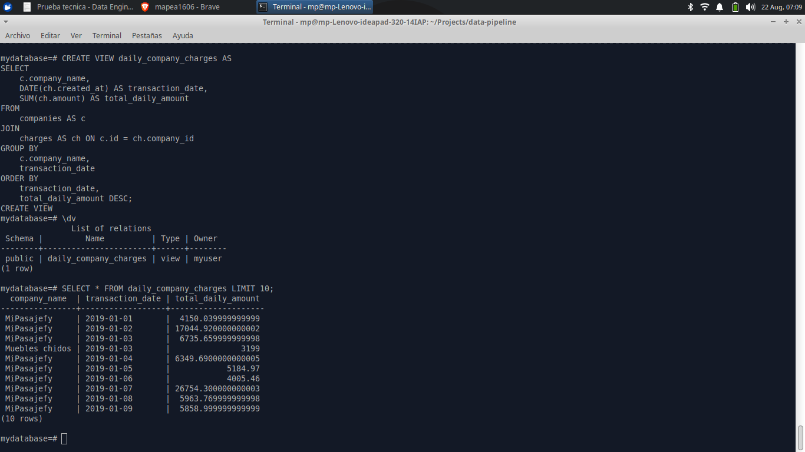

# Data Pipeline: ETL Project for Company Charges

This project demonstrates a complete data pipeline to extract, transform, and load (ETL) raw transactional data into a clean, structured, and queryable format. The pipeline processes raw charge data from various companies, handles data inconsistencies, and prepares it for business intelligence and analysis.

This project utilizes **Python** for its robust ecosystem of data processing libraries like Pandas and SQLAlchemy, making it highly suitable for ETL tasks. **PostgreSQL** was chosen as the relational database due to its reliability, strong support for SQL standards, advanced features like views, and open-source nature, making it a powerful and cost-effective solution for storing and querying structured data.

---

### Technologies Used

* **Python**: The main programming language for the ETL scripts.
* **Pandas**: Used for data manipulation, cleaning, and transformation.
* **PostgreSQL**: The relational database used to store the raw and final processed data.
* **SQLAlchemy**: Python library to interact with the PostgreSQL database.
* **Docker & Docker Compose**: Used to manage the PostgreSQL database environment, ensuring consistency and portability.

---

### Pipeline Summary

The pipeline is composed of three main stages, each handled by a dedicated Python script.

#### 1. Ingestion (`data_ingestion.py`)

This script connects to the PostgreSQL database and loads raw data from a CSV file into a staging table named `raw_charges`. It handles the initial extraction and raw data storage.

* **Outcome**: Successfully loaded **9,997** rows into the staging table after handling initial data integrity checks (dropping rows with null IDs).

#### 2. Transformation (`data_transformation.py`)

This script reads data from the `raw_charges` table, performs critical data cleaning, and prepares two separate DataFrames (`charges` and `companies`) for loading. This step was crucial for addressing several data quality issues.

* **Data Cleaning**:
    * **Invalid Dates**: Filtered out **3** rows with invalid `created_at` dates using flexible date parsing.
    * **Company Names**: Standardized inconsistent company names (e.g., "MiPasajefy" and "Muebles chidos") and dropped **3** rows with null company names.

* **Outcome**: The script produced a clean `charges` DataFrame with **9,991** rows and a `companies` DataFrame with **2** unique companies.

#### 3. Loading (`data_loading.py`)

This script orchestrates the final loading process. It handles complex table and view dependencies by first dropping any existing objects (including the `daily_company_charges` view), and then loads the clean DataFrames into the final `companies` and `charges` tables. This ensures the pipeline is robust and can be run multiple times without errors.

* **Outcome**: Successfully loaded **2** rows into the `companies` table and **9,991** rows into the `charges` table.

---

### Final Analysis (Section 1.5)

To validate that the pipeline is ready for analysis and to address the project specification, a database view was created to show the total transaction amount per day for each company. The final query on this view demonstrates the cleanliness and usability of the processed data.

#### SQL View Creation

To create the view, execute the following SQL in your PostgreSQL database:

````sql
CREATE VIEW daily_company_charges AS
SELECT
    c.company_name,
    DATE(ch.created_at) AS transaction_date,
    SUM(ch.amount) AS total_daily_amount
FROM
    companies AS c
JOIN
    charges AS ch ON c.id = ch.company_id
GROUP BY
    c.company_name,
    transaction_date
ORDER BY
    transaction_date,
    total_daily_amount DESC;


